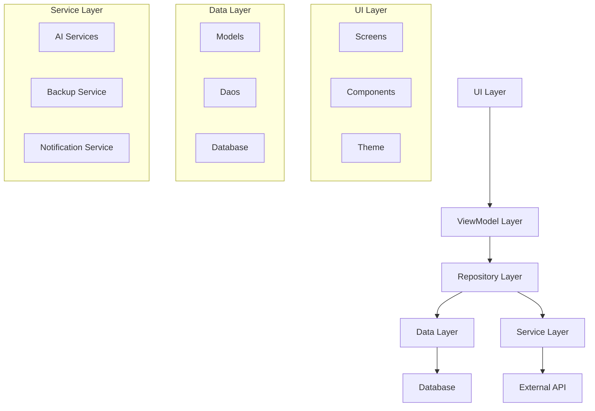

# CalorieAI 项目文件统计与分析报告

生成时间：2026-03-17

## 一、项目概览

### 1.1 文件统计总览

| 分类 | 文件数量 | 说明 |
|------|---------|------|
| **data层** | 28个 | 数据模型、Dao、Repository |
| **service层** | 22个 | AI服务、备份服务、通知服务等 |
| **ui层** | 75个 | Screen、Component、Theme、Animation |
| **utils层** | 4个 | 工具类 |
| **di层** | 3个 | 依赖注入模块 |
| **其他** | 8个 | Application、MainActivity等 |
| **总计** | **140个** | - |

---

## 二、data层文件分析（28个文件）

### 2.1 数据模型（Model）- 15个文件

#### APICallRecord.kt
**路径**: `data/model/APICallRecord.kt`
**作用**: API调用记录数据模型
**类**:
- `APICallRecord` - API调用记录实体类
  - 属性: id, timestamp, configId, configName, modelId, inputText, outputText, promptTokens, completionTokens, totalTokens, cost, duration, isSuccess, errorMessage
- `APICallStats` - API调用统计
  - 属性: totalCalls, totalTokens, totalCost, avgDuration, todayCalls, todayCost, monthCalls, monthCost

#### AIConfig.kt
**路径**: `data/model/AIConfig.kt`
**作用**: AI配置数据模型
**类**:
- `AIConfig` - AI配置实体类
- `AIProtocol` - AI协议枚举（OPENAI, CLAUDE, LONGCAT等）
- `IconType` - 图标类型枚举
- `AIConfigPresets` - AI配置预设

#### AIFunctionConfig.kt
**路径**: `data/model/AIFunctionConfig.kt`
**作用**: AI功能配置
**类**:
- `AIFunctionConfig` - AI功能配置实体

#### AIChatHistory.kt
**路径**: `data/model/AIChatHistory.kt`
**作用**: AI聊天历史记录
**类**:
- `AIChatHistory` - 聊天历史实体
- `ChatMessage` - 聊天消息

#### AITokenUsage.kt
**路径**: `data/model/AITokenUsage.kt`
**作用**: AI Token使用记录
**类**:
- `AITokenUsage` - Token使用实体
- `TokenUsageStats` - Token使用统计

#### FoodRecord.kt
**路径**: `data/model/FoodRecord.kt`
**作用**: 食物记录数据模型
**类**:
- `FoodRecord` - 食物记录实体
- `Ingredient` - 食材
- `MealType` - 餐次类型枚举
- `ConfidenceLevel` - 置信度枚举

#### ExerciseRecord.kt
**路径**: `data/model/ExerciseRecord.kt`
**作用**: 运动记录数据模型
**类**:
- `ExerciseRecord` - 运动记录实体
- `ExerciseType` - 运动类型枚举

#### WaterRecord.kt
**路径**: `data/model/WaterRecord.kt`
**作用**: 饮水记录数据模型
**类**:
- `WaterRecord` - 饮水记录实体

#### WeightRecord.kt
**路径**: `data/model/WeightRecord.kt`
**作用**: 体重记录数据模型
**类**:
- `WeightRecord` - 体重记录实体

#### UserSettings.kt
**路径**: `data/model/UserSettings.kt`
**作用**: 用户设置数据模型
**类**:
- `UserSettings` - 用户设置实体
- `ActivityLevel` - 活动水平枚举
- `DietaryPreference` - 饮食偏好枚举

#### MealPlanCache.kt
**路径**: `data/model/MealPlanCache.kt`
**作用**: 餐计划缓存
**类**:
- `MealPlanCache` - 餐计划缓存实体

#### NutritionReference.kt
**路径**: `data/model/NutritionReference.kt`
**作用**: 营养参考数据
**类**:
- `NutritionReference` - 营养参考实体

#### TutorialStep.kt
**路径**: `data/model/TutorialStep.kt`
**作用**: 教程步骤数据模型
**类**:
- `TutorialStep` - 教程步骤实体

### 2.2 数据访问对象（Dao）- 10个文件

#### APICallRecordDao.kt
**路径**: `data/local/APICallRecordDao.kt`
**作用**: API调用记录数据访问
**函数**:
- `insertRecord(record)` - 插入记录
- `getAllRecords()` - 获取所有记录
- `getRecordsBetween(start, end)` - 获取时间段内记录
- `getStats(...)` - 获取统计数据
- `deleteRecord(id)` - 删除记录
- `deleteAllRecords()` - 删除所有记录

#### AIConfigDao.kt
**路径**: `data/local/AIConfigDao.kt`
**作用**: AI配置数据访问
**函数**:
- `insertConfig(config)` - 插入配置
- `getAllConfigs()` - 获取所有配置
- `getConfigById(id)` - 根据ID获取配置
- `updateConfig(config)` - 更新配置
- `deleteConfig(id)` - 删除配置

#### AITokenUsageDao.kt
**路径**: `data/local/AITokenUsageDao.kt`
**作用**: Token使用数据访问
**函数**:
- `insertTokenUsage(usage)` - 插入使用记录
- `getTokenUsageBetween(start, end)` - 获取时间段内使用
- `getTotalTokensBetween(start, end)` - 获取总Token数
- `getTotalCostBetween(start, end)` - 获取总成本

#### AIChatHistoryDao.kt
**路径**: `data/local/AIChatHistoryDao.kt`
**作用**: 聊天历史数据访问
**函数**:
- `insertHistory(history)` - 插入历史
- `getAllHistory()` - 获取所有历史
- `getHistoryBySessionId(id)` - 根据会话ID获取

#### FoodRecordDao.kt
**路径**: `data/local/FoodRecordDao.kt`
**作用**: 食物记录数据访问
**函数**:
- `insertRecord(record)` - 插入记录
- `getRecordsByDate(date)` - 根据日期获取
- `getAllRecords()` - 获取所有记录
- `deleteRecord(id)` - 删除记录

#### ExerciseRecordDao.kt
**路径**: `data/local/ExerciseRecordDao.kt`
**作用**: 运动记录数据访问
**函数**:
- `insertRecord(record)` - 插入记录
- `getRecordsByDate(date)` - 根据日期获取
- `deleteRecord(id)` - 删除记录

#### WaterRecordDao.kt
**路径**: `data/local/dao/WaterRecordDao.kt`
**作用**: 饮水记录数据访问
**函数**:
- `insertRecord(record)` - 插入记录
- `getRecordsByDate(date)` - 根据日期获取
- `getTodayTotal()` - 获取今日总量

#### WeightRecordDao.kt
**路径**: `data/repository/WeightRecordDao.kt`
**作用**: 体重记录数据访问
**函数**:
- `insert(record)` - 插入记录
- `getRecordsBetween(start, end)` - 获取时间段内记录
- `getLatestRecord()` - 获取最新记录

#### UserSettingsDao.kt
**路径**: `data/local/UserSettingsDao.kt`
**作用**: 用户设置数据访问
**函数**:
- `getSettings()` - 获取设置
- `saveSettings(settings)` - 保存设置

#### AppDatabase.kt
**路径**: `data/local/AppDatabase.kt`
**作用**: Room数据库定义
**类**:
- `AppDatabase` - 数据库抽象类
- `MIGRATION_12_13` - 数据库迁移
- `MIGRATION_13_14` - 数据库迁移
- `MIGRATION_14_15` - 数据库迁移

### 2.3 数据仓库（Repository）- 10个文件

#### APICallRecordRepository.kt
**路径**: `data/repository/APICallRecordRepository.kt`
**作用**: API调用记录仓库
**函数**:
- `recordCall(...)` - 记录API调用
- `getAllRecords()` - 获取所有记录
- `getStats()` - 获取统计
- `deleteRecord(id)` - 删除记录
- `cleanupOldData()` - 清理旧数据

#### AIConfigRepository.kt
**路径**: `data/repository/AIConfigRepository.kt`
**作用**: AI配置仓库
**函数**:
- `getDefaultConfig()` - 获取默认配置
- `getAllConfigs()` - 获取所有配置
- `saveConfig(config)` - 保存配置
- `deleteConfig(id)` - 删除配置

#### AITokenUsageRepository.kt
**路径**: `data/repository/AITokenUsageRepository.kt`
**作用**: Token使用仓库
**函数**:
- `recordTokenUsage(...)` - 记录Token使用
- `getTokenUsageStats()` - 获取使用统计
- `cleanupOldData()` - 清理旧数据

#### AIChatHistoryRepository.kt
**路径**: `data/repository/AIChatHistoryRepository.kt`
**作用**: 聊天历史仓库
**函数**:
- `saveHistory(history)` - 保存历史
- `getAllHistory()` - 获取所有历史
- `deleteHistory(id)` - 删除历史

#### FoodRecordRepository.kt
**路径**: `data/repository/FoodRecordRepository.kt`
**作用**: 食物记录仓库
**函数**:
- `addRecord(record)` - 添加记录
- `getRecordsByDate(date)` - 根据日期获取
- `getAllRecordsOnce()` - 获取所有记录一次
- `deleteRecord(id)` - 删除记录

#### ExerciseRecordRepository.kt
**路径**: `data/repository/ExerciseRecordRepository.kt`
**作用**: 运动记录仓库
**函数**:
- `addRecord(record)` - 添加记录
- `getRecordsBetweenSync(start, end)` - 同步获取时间段内记录
- `deleteRecord(id)` - 删除记录

#### WaterRecordRepository.kt
**路径**: `data/repository/WaterRecordRepository.kt`
**作用**: 饮水记录仓库
**函数**:
- `addRecord(record)` - 添加记录
- `getTodayTotal()` - 获取今日总量
- `getRecordsByDate(date)` - 根据日期获取

#### WeightRecordRepository.kt
**路径**: `data/repository/WeightRecordRepository.kt`
**作用**: 体重记录仓库
**函数**:
- `insert(record)` - 插入记录
- `getRecordsBetweenSync(start, end)` - 同步获取时间段内记录
- `getLatestWeight()` - 获取最新体重

#### UserSettingsRepository.kt
**路径**: `data/repository/UserSettingsRepository.kt`
**作用**: 用户设置仓库
**函数**:
- `getSettings()` - 获取设置
- `saveSettings(settings)` - 保存设置

#### AIFunctionConfigRepository.kt
**路径**: `data/repository/AIFunctionConfigRepository.kt`
**作用**: AI功能配置仓库
**函数**:
- `getFunctionConfig()` - 获取功能配置
- `saveFunctionConfig(config)` - 保存功能配置

---

## 三、service层文件分析（22个文件）

### 3.1 AI服务（11个文件）

#### AIApiClient.kt
**路径**: `service/ai/common/AIApiClient.kt`
**作用**: AI API客户端
**类**:
- `AIApiClient` - API客户端单例
**函数**:
- `chatRaw(...)` - 发送聊天请求（返回原始响应）
- `chatStream(...)` - 发送流式聊天请求
- `extractOpenAIUsage(...)` - 提取OpenAI使用量
- `extractClaudeUsage(...)` - 提取Claude使用量

#### AIChatService.kt
**路径**: `service/ai/AIChatService.kt`
**作用**: AI聊天服务
**函数**:
- `sendMessage(message)` - 发送消息
- `sendMessageStream(message)` - 流式发送消息
- `recordTokenUsage(...)` - 记录Token使用

#### AIDefaultConfigInitializer.kt
**路径**: `service/ai/AIDefaultConfigInitializer.kt`
**作用**: AI默认配置初始化器
**函数**:
- `initializeDefaultConfig()` - 初始化默认配置

#### AIContextService.kt
**路径**: `service/ai/AIContextService.kt`
**作用**: AI上下文服务
**函数**:
- `buildContext()` - 构建上下文
- `getRecentMeals()` - 获取最近餐次

#### FoodImageAnalysisService.kt
**路径**: `service/ai/FoodImageAnalysisService.kt`
**作用**: 食物图片分析服务
**函数**:
- `analyzeFoodImage(imageBase64)` - 分析食物图片

#### FoodTextAnalysisService.kt
**路径**: `service/ai/FoodTextAnalysisService.kt`
**作用**: 食物文本分析服务
**函数**:
- `analyzeFoodText(text)` - 分析食物文本

#### MealPlanService.kt
**路径**: `service/ai/MealPlanService.kt`
**作用**: 餐计划服务
**函数**:
- `generateMealPlan()` - 生成餐计划

#### NutritionRecognitionService.kt
**路径**: `service/ai/NutritionRecognitionService.kt`
**作用**: 营养识别服务
**函数**:
- `recognizeNutrition(imageBase64)` - 识别营养

#### AIRateLimiter.kt
**路径**: `service/ai/AIRateLimiter.kt`
**作用**: AI速率限制器
**函数**:
- `canMakeCall(configId, limit)` - 检查是否可以调用
- `recordCall(configId)` - 记录调用

### 3.2 备份服务（2个文件）

#### BackupService.kt
**路径**: `service/backup/BackupService.kt`
**作用**: 备份服务
**类**:
- `BackupData` - 备份数据模型
- `FoodRecordBackup` - 食物记录备份
- `ExerciseRecordBackup` - 运动记录备份
- `WeightRecordBackup` - 体重记录备份
- `WaterRecordBackup` - 饮水记录备份
- `UserSettingsBackup` - 用户设置备份
- `AIConfigBackup` - AI配置备份
**函数**:
- `createBackup(uri, includeAIConfigs)` - 创建备份
- `restoreBackup(uri)` - 恢复备份
- `getBackupInfo(uri)` - 获取备份信息

#### BackupManager.kt
**路径**: `service/backup/BackupManager.kt`
**作用**: 备份管理器
**函数**:
- `scheduleAutoBackup()` - 安排自动备份
- `performBackup()` - 执行备份

### 3.3 通知服务（2个文件）

#### NotificationHelper.kt
**路径**: `service/notification/NotificationHelper.kt`
**作用**: 通知助手
**函数**:
- `showNotification(title, message)` - 显示通知
- `createNotificationChannel()` - 创建通知渠道

#### MealReminderWorker.kt
**路径**: `service/notification/MealReminderWorker.kt`
**作用**: 餐次提醒Worker
**函数**:
- `doWork()` - 执行工作

### 3.4 其他服务（7个文件）

#### TutorialManager.kt
**路径**: `service/tutorial/TutorialManager.kt`
**作用**: 教程管理器
**函数**:
- `shouldShowTutorial()` - 是否显示教程
- `markTutorialComplete()` - 标记教程完成

#### VoiceInputHelper.kt
**路径**: `service/voice/VoiceInputHelper.kt`
**作用**: 语音输入助手
**函数**:
- `startListening()` - 开始监听
- `stopListening()` - 停止监听

#### CalorieWidget.kt
**路径**: `service/widget/CalorieWidget.kt`
**作用**: 卡路里小组件
**类**:
- `CalorieWidget` - 小组件类

#### CalorieWidgetSizes.kt
**路径**: `service/widget/CalorieWidgetSizes.kt`
**作用**: 小组件尺寸定义

#### AIPredictionService.kt
**路径**: `service/AIPredictionService.kt`
**作用**: AI预测服务
**函数**:
- `predictCalories()` - 预测卡路里

---

## 四、ui层文件分析（75个文件）

### 4.1 Screen屏幕（35个文件）

#### HomeScreen.kt
**路径**: `ui/screens/home/HomeScreen.kt`
**作用**: 主页屏幕
**组件**:
- `HomeScreen` - 主页组件
- `HomeViewModel` - 主页ViewModel

#### OverviewScreen.kt
**路径**: `ui/screens/overview/OverviewScreen.kt`
**作用**: 概览屏幕
**组件**:
- `OverviewScreen` - 概览组件
- `MonthlySummaryCard` - 月度总结卡片

#### StatsScreen.kt
**路径**: `ui/screens/stats/StatsScreen.kt`
**作用**: 统计屏幕
**组件**:
- `StatsScreen` - 统计组件
- `StatsViewModel` - 统计ViewModel

#### AIChatScreen.kt
**路径**: `ui/screens/ai/AIChatScreen.kt`
**作用**: AI聊天屏幕
**组件**:
- `AIChatScreen` - AI聊天组件
- `AIChatViewModel` - AI聊天ViewModel

#### AISettingsScreen.kt
**路径**: `ui/screens/settings/AISettingsScreen.kt`
**作用**: AI设置屏幕
**组件**:
- `AISettingsScreen` - AI设置组件
- `AISettingsViewModel` - AI设置ViewModel

#### SettingsScreen.kt
**路径**: `ui/screens/settings/SettingsScreen.kt`
**作用**: 设置屏幕
**组件**:
- `SettingsScreen` - 设置组件
- `SettingsViewModel` - 设置ViewModel

#### ProfileScreen.kt
**路径**: `ui/screens/settings/ProfileScreen.kt`
**作用**: 个人资料屏幕
**组件**:
- `ProfileScreen` - 个人资料组件
- `ProfileViewModel` - 个人资料ViewModel

#### AddFoodScreen.kt
**路径**: `ui/screens/add/AddFoodScreen.kt`
**作用**: 添加食物屏幕
**组件**:
- `AddFoodScreen` - 添加食物组件
- `AddFoodViewModel` - 添加食物ViewModel

#### ManualAddScreen.kt
**路径**: `ui/screens/add/ManualAddScreen.kt`
**作用**: 手动添加屏幕
**组件**:
- `ManualAddScreen` - 手动添加组件
- `ManualAddViewModel` - 手动添加ViewModel

#### CameraScreen.kt
**路径**: `ui/screens/camera/CameraScreen.kt`
**作用**: 相机屏幕
**组件**:
- `CameraScreen` - 相机组件
- `CameraViewModel` - 相机ViewModel

#### PhotoAnalysisScreen.kt
**路径**: `ui/screens/camera/PhotoAnalysisScreen.kt`
**作用**: 照片分析屏幕
**组件**:
- `PhotoAnalysisScreen` - 照片分析组件
- `PhotoAnalysisViewModel` - 照片分析ViewModel

#### ResultScreen.kt
**路径**: `ui/screens/result/ResultScreen.kt`
**作用**: 结果屏幕
**组件**:
- `ResultScreen` - 结果组件
- `ResultViewModel` - 结果ViewModel

#### WaterTrackerScreen.kt
**路径**: `ui/screens/water/WaterTrackerScreen.kt`
**作用**: 饮水追踪屏幕
**组件**:
- `WaterTrackerScreen` - 饮水追踪组件

#### WeightRecordScreen.kt
**路径**: `ui/screens/weight/WeightRecordScreen.kt`
**作用**: 体重记录屏幕
**组件**:
- `WeightRecordScreen` - 体重记录组件
- `WeightRecordViewModel` - 体重记录ViewModel

#### ExerciseRecordScreen.kt
**路径**: `ui/screens/exercise/ExerciseRecordScreen.kt`
**作用**: 运动记录屏幕
**组件**:
- `ExerciseRecordScreen` - 运动记录组件
- `ExerciseRecordViewModel` - 运动记录ViewModel

#### OnboardingFlow.kt
**路径**: `ui/screens/onboarding/OnboardingFlow.kt`
**作用**: 引导流程
**组件**:
- `OnboardingFlow` - 引导流程组件
- `OnboardingScreen1-6` - 引导页面1-6
- `OnboardingViewModel` - 引导ViewModel

#### BodyProfileScreen.kt
**路径**: `ui/screens/profile/BodyProfileScreen.kt`
**作用**: 身体档案屏幕
**组件**:
- `BodyProfileScreen` - 身体档案组件
- `BodyProfileViewModel` - 身体档案ViewModel

#### WeightHistoryScreen.kt
**路径**: `ui/screens/profile/WeightHistoryScreen.kt`
**作用**: 体重历史屏幕
**组件**:
- `WeightHistoryScreen` - 体重历史组件
- `WeightHistoryViewModel` - 体重历史ViewModel

#### WaterHistoryScreen.kt
**路径**: `ui/screens/profile/WaterHistoryScreen.kt`
**作用**: 饮水历史屏幕
**组件**:
- `WaterHistoryScreen` - 饮水历史组件
- `WaterHistoryViewModel` - 饮水历史ViewModel

### 4.2 Component组件（25个文件）

#### AIChatWidget.kt
**路径**: `ui/components/AIChatWidget.kt`
**作用**: AI聊天小组件
**组件**:
- `AIChatWidget` - AI聊天小组件主组件
- `FloatingButton` - 悬浮按钮
- `AIChatMiniWindow` - 迷你窗口
- `GlassInput` - 玻璃风格输入框
- `MessageItem` - 消息项

#### MarkdownText.kt
**路径**: `ui/components/markdown/MarkdownText.kt`
**作用**: Markdown文本渲染
**组件**:
- `MarkdownText` - Markdown文本组件

#### TypewriterText.kt
**路径**: `ui/components/TypewriterText.kt`
**作用**: 打字机文本效果
**组件**:
- `TypewriterText` - 打字机文本组件

#### HeatmapCalendar.kt
**路径**: `ui/components/HeatmapCalendar.kt`
**作用**: 热力图日历
**组件**:
- `HeatmapCalendar` - 热力图日历组件

#### BottomNavBar.kt
**路径**: `ui/components/BottomNavBar.kt`
**作用**: 底部导航栏
**组件**:
- `BottomNavBar` - 底部导航栏组件

#### CalendarView.kt
**路径**: `ui/components/CalendarView.kt`
**作用**: 日历视图
**组件**:
- `CalendarView` - 日历视图组件

#### DateSelector.kt
**路径**: `ui/components/DateSelector.kt`
**作用**: 日期选择器
**组件**:
- `DateSelector` - 日期选择器组件

#### TutorialOverlay.kt
**路径**: `ui/components/TutorialOverlay.kt`
**作用**: 教程覆盖层
**组件**:
- `TutorialOverlay` - 教程覆盖层组件

#### VoiceInputDialog.kt
**路径**: `ui/components/VoiceInputDialog.kt`
**作用**: 语音输入对话框
**组件**:
- `VoiceInputDialog` - 语音输入对话框组件

#### ExerciseDialog.kt
**路径**: `ui/components/ExerciseDialog.kt`
**作用**: 运动对话框
**组件**:
- `ExerciseDialog` - 运动对话框组件

#### TokenUsageCard.kt
**路径**: `ui/components/TokenUsageCard.kt`
**作用**: Token使用卡片
**组件**:
- `TokenUsageCard` - Token使用卡片组件

#### MonthlySummaryCard.kt
**路径**: `ui/components/MonthlySummaryCard.kt`
**作用**: 月度总结卡片
**组件**:
- `MonthlySummaryCard` - 月度总结卡片组件

#### LiquidGlassComponents.kt
**路径**: `ui/components/LiquidGlassComponents.kt`
**作用**: 液态玻璃组件
**组件**:
- `LiquidGlassCard` - 液态玻璃卡片
- `LiquidGlassButton` - 液态玻璃按钮

#### LoadingComponents.kt
**路径**: `ui/components/LoadingComponents.kt`
**作用**: 加载组件
**组件**:
- `LoadingIndicator` - 加载指示器
- `LoadingOverlay` - 加载覆盖层

#### ErrorComponents.kt
**路径**: `ui/components/ErrorComponents.kt`
**作用**: 错误组件
**组件**:
- `ErrorMessage` - 错误消息
- `ErrorCard` - 错误卡片

### 4.3 Chart图表（7个文件）

#### PieChartView.kt
**路径**: `ui/components/charts/PieChartView.kt`
**作用**: 饼图视图
**组件**:
- `PieChartView` - 饼图组件

#### BarChartView.kt
**路径**: `ui/components/charts/BarChartView.kt`
**作用**: 柱状图视图
**组件**:
- `BarChartView` - 柱状图组件

#### LineChartView.kt
**路径**: `ui/components/charts/LineChartView.kt`
**作用**: 折线图视图
**组件**:
- `LineChartView` - 折线图组件

#### RadarChartView.kt
**路径**: `ui/components/charts/RadarChartView.kt`
**作用**: 雷达图视图
**组件**:
- `RadarChartView` - 雷达图组件

#### EnhancedWeightChart.kt
**路径**: `ui/components/charts/EnhancedWeightChart.kt`
**作用**: 增强体重图表
**组件**:
- `EnhancedWeightChart` - 增强体重图表组件

#### UnifiedTrendChart.kt
**路径**: `ui/components/charts/UnifiedTrendChart.kt`
**作用**: 统一趋势图表
**组件**:
- `UnifiedTrendChart` - 统一趋势图表组件

### 4.4 Theme主题（6个文件）

#### Theme.kt
**路径**: `ui/theme/Theme.kt`
**作用**: 主题定义
**类**:
- `CalorieAITheme` - 主题组合函数

#### Color.kt
**路径**: `ui/theme/Color.kt`
**作用**: 颜色定义
**变量**:
- 各种颜色常量

#### Type.kt
**路径**: `ui/theme/Type.kt`
**作用**: 字体类型定义
**变量**:
- Typography字体排版

#### GlassColor.kt
**路径**: `ui/theme/GlassColor.kt`
**作用**: 玻璃风格颜色
**变量**:
- GlassDarkColors - 深色玻璃颜色
- GlassLightColors - 浅色玻璃颜色

#### GlassModifiers.kt
**路径**: `ui/theme/GlassModifiers.kt`
**作用**: 玻璃风格修饰符
**函数**:
- `glassEffect()` - 玻璃效果修饰符
- `glassCardThemed()` - 玻璃卡片修饰符

#### GlassUtils.kt
**路径**: `ui/theme/GlassUtils.kt`
**作用**: 玻璃风格工具
**函数**:
- 各种玻璃效果辅助函数

### 4.5 Animation动画（4个文件）

#### Animations.kt
**路径**: `ui/components/Animations.kt`
**作用**: 通用动画
**函数**:
- 各种动画效果函数

#### ListAnimations.kt
**路径**: `ui/animations/ListAnimations.kt`
**作用**: 列表动画
**函数**:
- 列表项动画效果

#### CardAnimations.kt
**路径**: `ui/animations/CardAnimations.kt`
**作用**: 卡片动画
**函数**:
- 卡片动画效果

#### NavigationAnimations.kt
**路径**: `ui/animations/NavigationAnimations.kt`
**作用**: 导航动画
**函数**:
- 导航转场动画效果

### 4.6 Navigation导航（1个文件）

#### NavGraph.kt
**路径**: `ui/navigation/NavGraph.kt`
**作用**: 导航图
**函数**:
- `NavGraph` - 导航图组件
- 各种路由定义

---

## 五、utils层文件分析（4个文件）

#### DateUtils.kt
**路径**: `utils/DateUtils.kt`
**作用**: 日期工具类
**函数**:
- `formatDate(timestamp)` - 格式化日期
- `getStartOfDay(date)` - 获取一天开始时间
- `getEndOfDay(date)` - 获取一天结束时间

#### StatsUtils.kt
**路径**: `utils/StatsUtils.kt`
**作用**: 统计工具类
**函数**:
- `calculateAverage(values)` - 计算平均值
- `calculateTrend(values)` - 计算趋势

#### PerformanceUtils.kt
**路径**: `utils/PerformanceUtils.kt`
**作用**: 性能工具类
**函数**:
- `measureTime(block)` - 测量执行时间

#### EncouragementMessages.kt
**路径**: `utils/EncouragementMessages.kt`
**作用**: 鼓励消息
**变量**:
- 各种鼓励消息常量

---

## 六、di层文件分析（3个文件）

#### DatabaseModule.kt
**路径**: `di/DatabaseModule.kt`
**作用**: 数据库模块
**函数**:
- `provideAppDatabase()` - 提供数据库实例
- `provideFoodRecordDao()` - 提供食物记录Dao
- `provideUserSettingsDao()` - 提供用户设置Dao
- 等其他Dao提供函数

#### AppModule.kt
**路径**: `di/AppModule.kt`
**作用**: 应用模块
**函数**:
- 各种服务提供函数

---

## 七、优化建议

### 7.1 代码质量优化

| 优先级 | 建议 | 涉及文件 |
|--------|------|---------|
| 高 | 提取重复的UI组件样式到公共主题 | 多个Screen文件 |
| 高 | 统一错误处理机制 | Repository文件 |
| 中 | 添加更多单元测试 | ViewModel文件 |
| 中 | 提取硬编码字符串到资源文件 | 多个文件 |

### 7.2 性能优化

| 优先级 | 建议 | 涉及文件 |
|--------|------|---------|
| 高 | 优化图片加载和缓存 | CameraScreen, PhotoAnalysisScreen |
| 高 | 减少不必要的重组 | 多个Composable函数 |
| 中 | 优化数据库查询 | Dao文件 |
| 中 | 添加分页加载 | 列表Screen |

### 7.3 架构优化

| 优先级 | 建议 | 说明 |
|--------|------|------|
| 高 | 统一ViewModel命名规范 | 部分ViewModel在viewmodel目录，部分在screens目录 |
| 中 | 添加UseCase层 | 分离业务逻辑 |
| 低 | 考虑多模块架构 | 随着项目增长 |

---

## 八、模块依赖关系图

---

## 九、总结

CalorieAI项目是一个功能完善的卡路里追踪应用，采用MVVM架构，使用Jetpack Compose构建UI，Room作为本地数据库，Hilt进行依赖注入。

**项目优点：**
- 清晰的分层架构
- 完善的数据持久化
- 丰富的UI组件和动画
- 良好的代码组织

**待改进项：**
- 部分ViewModel位置不统一
- 缺少单元测试
- 部分硬编码字符串需要国际化

**文件统计：**
- 总计约140个Kotlin文件
- data层：28个文件
- service层：22个文件
- ui层：75个文件
- utils层：4个文件
- di层：3个文件
- 其他：8个文件
